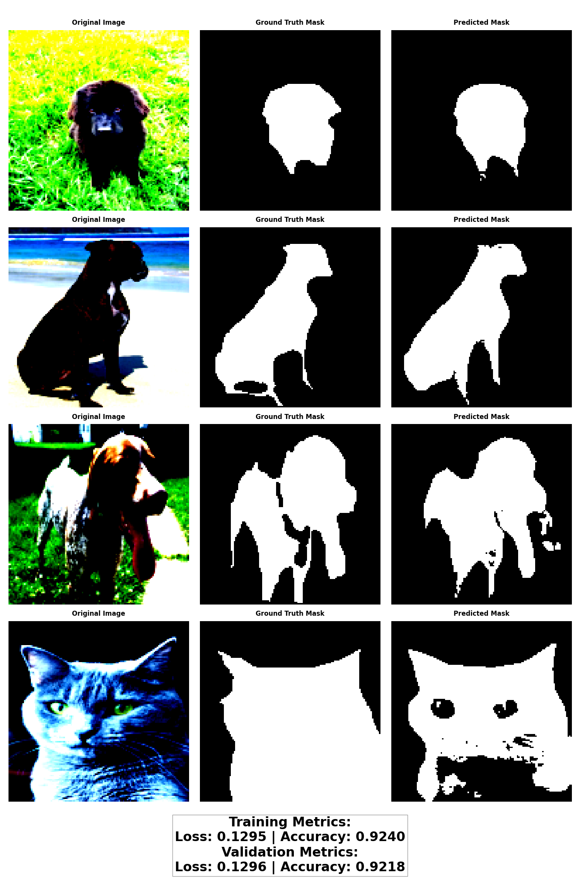

# Results and Visualizations

This page contains the results and visualizations from training different U-Net configurations on the Oxford-IIIT Pet Dataset.

## Training Details

- Number of epochs: 20
- Batch size: 8
- Learning rate: 0.001
- Optimizer: Adam
- Image size: 128x128
- Dataset split: 80% training, 20% validation

## Training logs, Individual Model ooutputs and Model Performance Comparison
### Training Log-1

### Training Log-2

## Model Performance Comparison

## Individual Configuration Results

### Configuration 1: MaxPool + TransConv + BCE

### Configuration 2: MaxPool + TransConv + Dice

### Configuration 3: StrideConv + TransConv + BCE

### Configuration 4: StrideConv + Upsample + Dice

