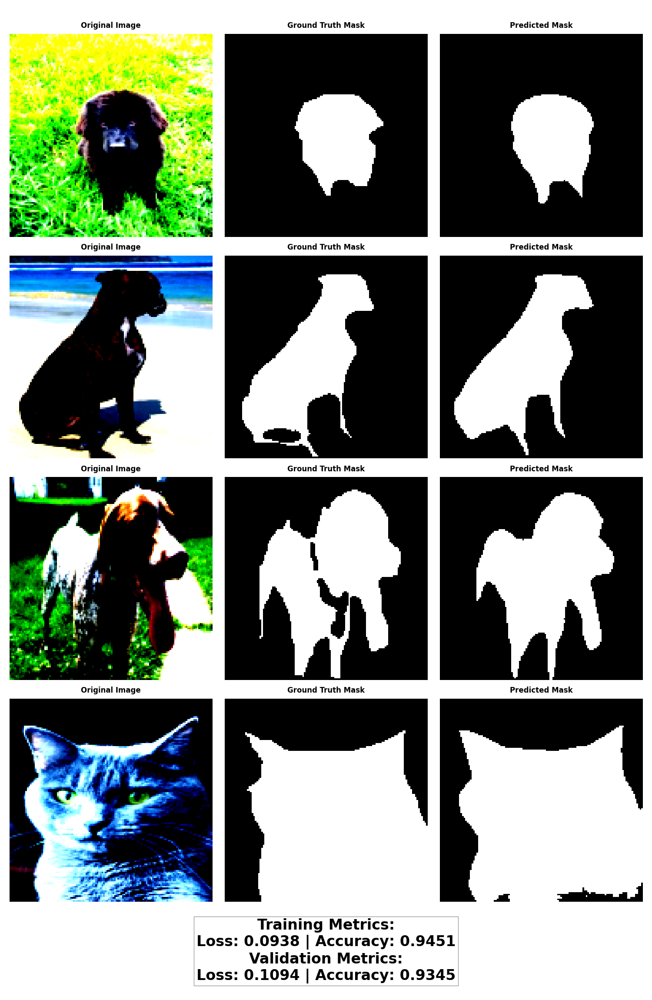

# Results and Visualizations

This page contains the results and visualizations from training different U-Net configurations on the Oxford-IIIT Pet Dataset.

## Training Details

- Number of epochs: 20
- Batch size: 8
- Learning rate: 0.001
- Optimizer: Adam
- Image size: 128x128
- Dataset split: 80% training, 20% validation

## Training logs

## Model Performance Comparison

## Individual Configuration Results

### Configuration 1: MaxPool + TransConv + BCE

### Configuration 2: MaxPool + TransConv + Dice

### Configuration 3: StrideConv + TransConv + BCE

### Configuration 4: StrideConv + Upsample + Dice

## Performance Metrics

| Configuration | Training Loss | Validation Loss | Training Accuracy | Validation Accuracy |
|--------------|---------------|-----------------|-------------------|-------------------|
| Config 1     | TBD           | TBD             | TBD               | TBD               |
| Config 2     | TBD           | TBD             | TBD               | TBD               |
| Config 3     | TBD           | TBD             | TBD               | TBD               |
| Config 4     | TBD           | TBD             | TBD               | TBD               |

